<h1 align="center">
    
   <br>
      bitplugg Flakes (ФОРК NIXOS ОТ FROST-PHOENIX) 
   <br>
       <br>

   <div align="center">
      <p></p>
      <div align="center">
         <a href="https://github.com/bitplugg/nixos-config/stargazers">
            
         </a>
         <a href="https://github.com/bitplugg/nixos-config/">
            
         </a>
         <a = href="https://nixos.org">
            
         </a>
         <a href="https://github.com/bitplugg/nixos-config/blob/main/LICENSE">
            
         </a>
      </div>
      <br>
   </div>
</h1>

### 🖼️ Галерея

<p align="center">
   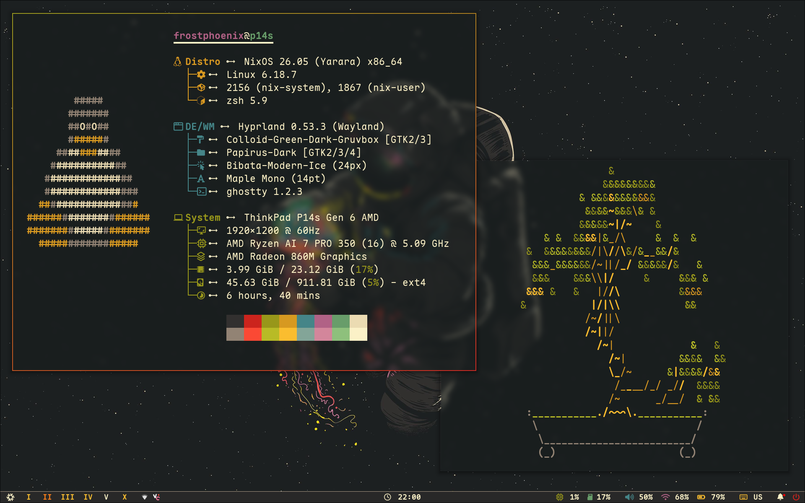 <br>
   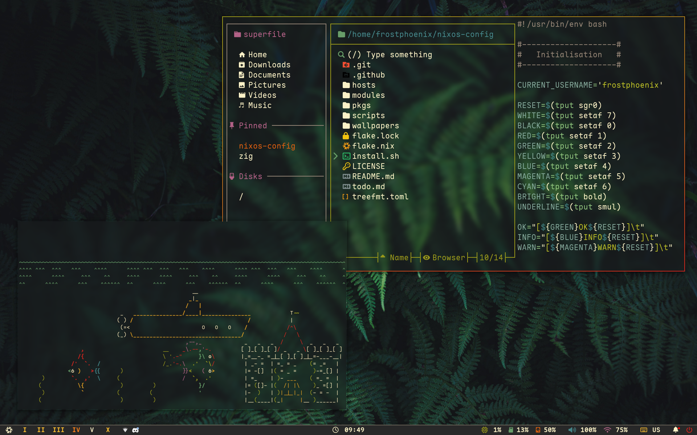 <br>
   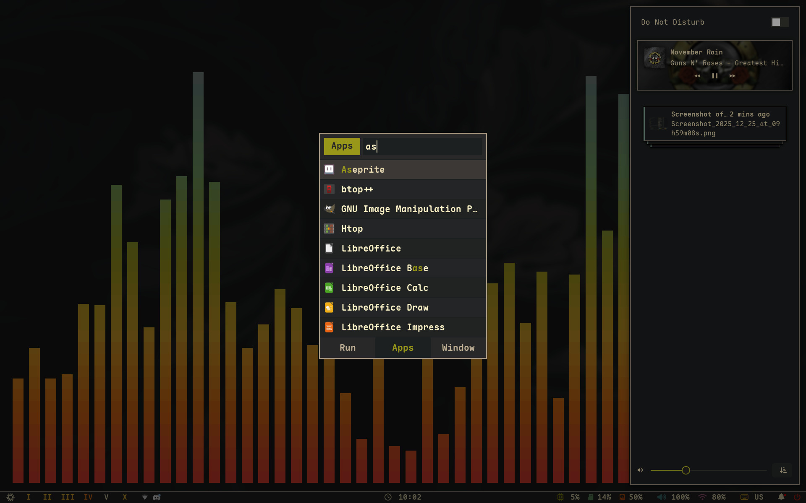 <br>
   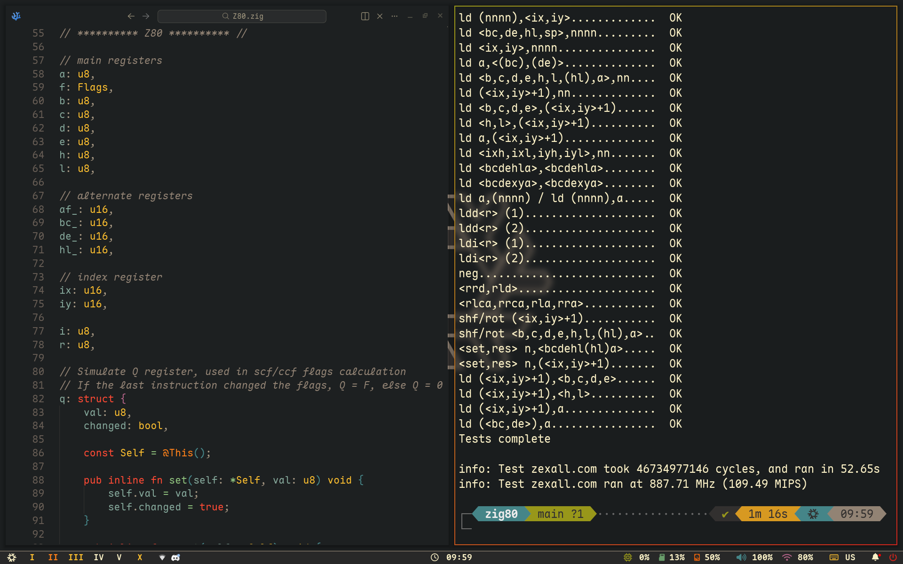 <br>
   Скриншоты обновлены <b>2025-12-25</b>
</p>

<details>
<summary>
   Waybar (РАЗВЕРНУТЬ)
</summary>
   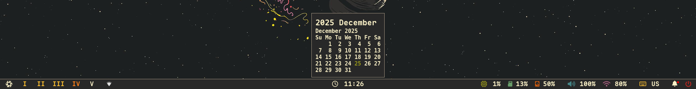 <br>
</details>
<details>
<summary>
   Swaylock (РАЗВЕРНУТЬ)
</summary>
   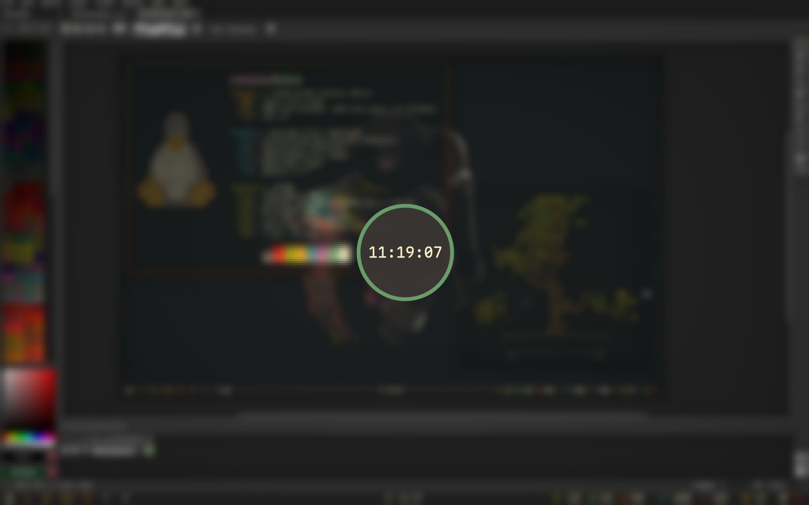 <br>
</details>
<details>
<summary>
   Hyprlock (РАЗВЕРНУТЬ)
</summary>
   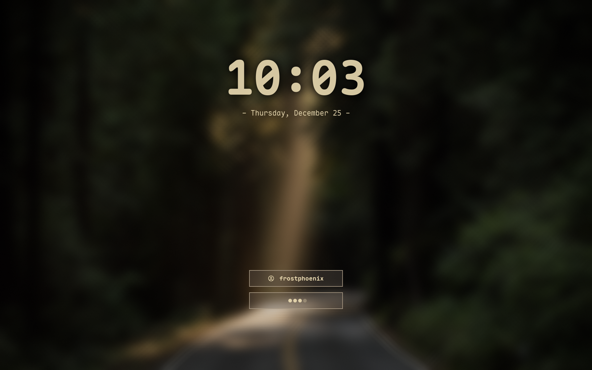 <br>
</details>
<details>
<summary>
   Меню питания (РАЗВЕРНУТЬ)
</summary>
   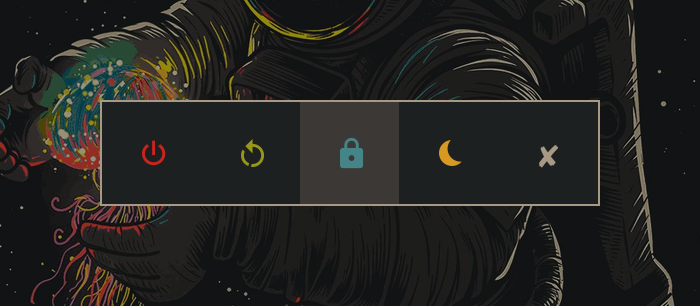 <br>
</details>
<details>
<summary>
   Лаунчер (РАЗВЕРНУТЬ)
</summary>
   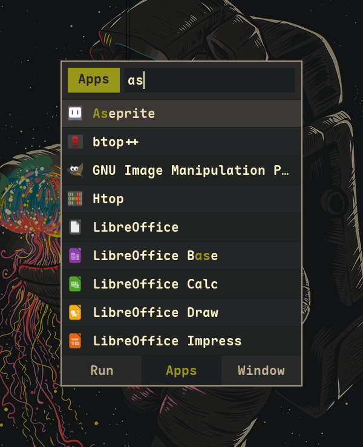 <br>
</details>
<details>
<summary>
   Выбор обоев (РАЗВЕРНУТЬ)
</summary>
   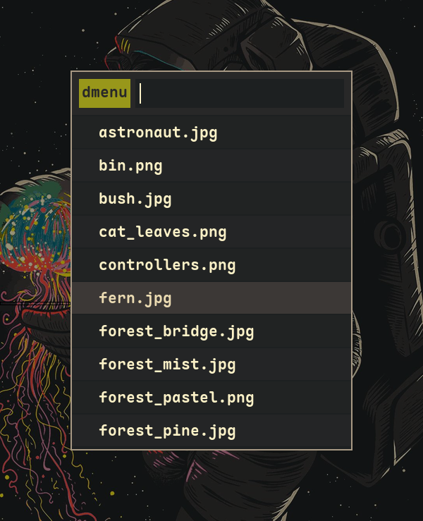 <br>
</details>
<details>
<summary>
   Уведомление (РАЗВЕРНУТЬ)
</summary>
   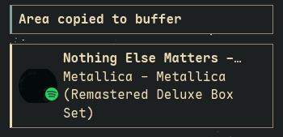 <br>
</details>
<details>
<summary>
   Центр уведомлений (РАЗВЕРНУТЬ)
</summary>
   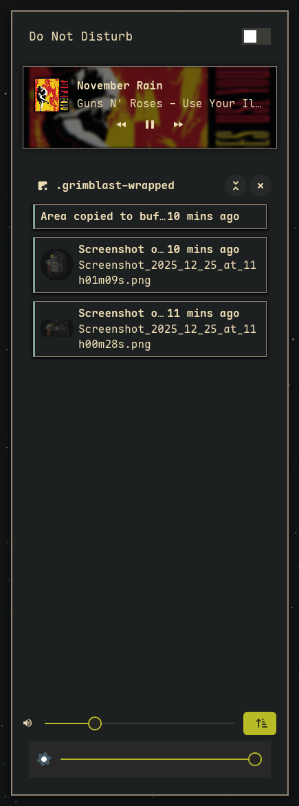 <br>
</details>

Мою предыдущую конфигурацию с Catppuccin можно найти [здесь](https://github.com/Frost-Phoenix/nixos-config/tree/catppuccin) (устарела).

# 🗃️ Обзор

> [!IMPORTANT]
> Это моя **личная** конфигурация NixOS, опубликованная для ознакомления и вдохновения.
>
> **Пожалуйста, учтите:**
> - Конфигурация постоянно развивается — ожидайте ломающих изменений
> - README и документация, скорее всего, устарели
> - Некоторые функции могут быть реализованы частично или не работать
> - Я **не даю никаких гарантий** стабильности
>
> **Прежде чем использовать любую часть этой конфигурации:**
> 1. Внимательно изучите код
> 2. Поймите, что делает каждый модуль
> 3. И адаптируйте его под свои нужды
> 4. ЭТО КАСТОМНЫЙ ФОРК ОТ FROST-PHOENIX, BITPLUGG ВНЁС 10% ИЗМЕНЕНИЙ, А ТАКЖЕ СДЕЛАНО С ЛЮБОВЬЮ К РОССИИ

## 📚 Структура

-   [flake.nix](flake.nix) Основа конфигурации
-   [hosts](hosts) Конфигурации для конкретных машин, содержащие уникальные настройки
    - [desktop](hosts/desktop/) Конфигурация для настольного ПК
    - [laptop](hosts/laptop/) Конфигурация для ноутбука
    - [vm](hosts/vm/) Конфигурация для виртуальных машин
-   [modules](modules) Модульная конфигурация NixOS
    -   [core](modules/core/) Основная конфигурация NixOS
    -   [homes](modules/home/) Конфигурация [Home-Manager](https://github.com/nix-community/home-manager)
-   [pkgs](pkgs) Пользовательские пакеты, собираемые из исходников
-   [scripts](scripts) Пользовательские скрипты
-   [wallpapers](wallpapers/) Коллекция обоев

## 🛠️ Компоненты системы и приложения

| Компонент | Программа |
| --- | :---: |
| **Оконный менеджер**          | [Hyprland][Hyprland] |
| **Панель**                    | [Waybar][Waybar] |
| **Лаунчер приложений**        | [Rofi][Rofi] |
| **Демон уведомлений**        | [swaync][swaync] |
| **Эмулятор терминала**       | [Ghostty][Ghostty] |
| **Оболочка**                  | [zsh][zsh] + [powerlevel10k][powerlevel10k] |
| **Текстовый редактор**        | [VSCodium][VSCodium] + [Neovim][Neovim] |
| **Управление сетью**         | [NetworkManager][NetworkManager] + [network-manager-applet][network-manager-applet] |
| **Мониторинг ресурсов**      | [Btop][Btop] |
| **Файловый менеджер**         | [superfile][superfile] + [nemo][nemo] |
| **Шрифты**                    | [Maple Mono][Maple Mono] |
| **Цветовая схема**            | [Gruvbox Dark Hard][Gruvbox] |
| **Тема GTK**                 | [Colloid gtk theme][Colloid gtk theme] |
| **Курсор**                    | [Bibata-Modern-Ice][Bibata-Modern-Ice] |
| **Иконки**                    | [Papirus-Dark][Papirus-Dark] |
| **Экран блокировки**         | [Hyprlock][Hyprlock] + [Swaylock-effects][Swaylock-effects] |
| **Просмотр изображений**     | [imv][imv] |
| **Медиаплеер**               | [mpv][mpv] |
| **Музыкальный плеер**        | [audacious][audacious] |
| **Создание скриншотов**      | [grimblast][grimblast] |
| **Запись экрана**            | [wf-recorder][wf-recorder] + [OBS][OBS] |
| **Буфер обмена**             | [wl-clip-persist][wl-clip-persist] |
| **Пипетка цвета**            | [hyprpicker][hyprpicker] |


## 📝 Алиасы оболочки

Алиасы для командной оболочки определены в двух местах: git-алиасы находятся в [`git.nix`](./modules/home/git.nix), остальные — в [`zsh_alias.nix`](./modules/home/zsh/zsh_alias.nix).

Вот некоторые из наиболее полезных:

| Алиас | Команда | Назначение |
|-------|---------|---------|
| `nft` | `nh-notify nh os test`   | Протестировать конфигурацию без изменения загрузчика |
| `nfs` | `nh-notify nh os switch` | Пересобрать и активировать новую конфигурацию |
| `nfu` | `nh-notify nh os switch --update` | Обновить все входные данные флейка и пересобрать/активировать (обновление системы) |
| `ns`  | `nom-shell --run zsh` | Войти в nix-shell |
| `nd`  | `nom develop --command zsh` | Войти в среду разработки из `flake.nix` |
| `nb`  | `nom build` | Собрать пакеты, экспортируемые флейком |
| `nc`  | `nh-notify nh clean all --keep 5` | Очистить старые поколения Nix, оставив только 5 последних |
| `nsearch` | `nh search` | Поиск пакетов в nixpkgs |

## 🛠️ Пользовательские скрипты

Все скрипты находятся в папке [`./scripts/scripts/`](./scripts/scripts/) и экспортируются как пакеты в [`./scripts/scripts.nix`](./scripts/scripts.nix).

Shell-скрипты автоматически обнаруживаются и становятся отдельными командами. Имя пакета совпадает с базовым именем скрипта без расширения (т.е. `ascii.sh` станет командой `ascii`).

**Замечание:** Скрипты должны иметь расширение `.sh` и быть отслеживаемыми git, чтобы их обнаружить автоматически.
 
**Так как скрипты представлены как пакеты, вы можете**:
- Запускать их прямо из терминала (например, `ascii`)
- Привязывать к сочетаниям клавиш (см. [binds.nix](./modules/home/hyprland/binds.nix) для примеров)
- Вызывать из других скриптов или инструментов автоматизации

**Чтобы добавить собственный скрипт**:
1. Добавьте новый файл `.sh` в `./scripts/scripts/`
2. Убедитесь, что он исполняемый (chmod +x)
3. Добавьте его в git (`git add ./scripts/scripts/<имя>.sh`)
4. Пересоберите конфигурацию (`nfs` или `nft`)
5. Скрипт станет сразу доступен как команда

**Расположение:** [`./scripts/`](./scripts/)

scripts/
├── scripts/ # Все shell-скрипты здесь
│ └── <script>.sh
└── scripts.nix # Автоматическая упаковка скриптов
text


## ⌨️ Горячие клавиши

Горячие клавиши определены в [`binds.nix`](./modules/home/hyprland/binds.nix). 

**Быстрый доступ:** Нажмите `$mod F1`, чтобы увидеть все сочетания.

Вот некоторые из основных:

| Категория | Примеры клавиш | Назначение |
|----------|--------------|---------|
| **Навигация** | `$mod + 0-9/стрелки` | переключение рабочих столов и окон |
| **Приложения** | `$mod + return/d/b/e` | терминал, лаунчер, браузер, файловый менеджер |
| **Управление окнами** | `$mod + q/f/space` | закрыть, полноэкранный режим, плавающее окно |
| **Медиа и инструменты** | `Print`, `$mod + c/w` | скриншоты, пипетка цвета, выбор обоев |
| **Система** | `$mod + escape/shift escape` | экран блокировки, меню питания |

# 🚀 Установка

> [!CAUTION]
> Это **личная** конфигурация. Используйте на свой страх и риск. Я не несу ответственности за любые возможные проблемы. Всегда изучайте и адаптируйте конфигурацию под свои нужды перед установкой.

> [!WARNING]
> **Использование в виртуальных машинах:** Hyprland **официально не поддерживает** виртуальные машины. Хотя он часто работает, могут возникнуть графические ошибки, проблемы с производительностью или полная несовместимость в зависимости от конфигурации VM.
>
> Если вы хотите протестировать конфигурацию в VM, ознакомьтесь с [руководством по VM](https://wiki.hypr.land/Getting-Started/Master-Tutorial/#vm).

### Шаги установки

#### 1. **Установите NixOS**
Сначала установите NixOS с помощью любого [графического ISO](https://nixos.org/download.html#nixos-iso).

*Проверено с установщиком GNOME с опцией "Без окружения рабочего стола"*

#### 2. **Клонируйте репозиторий**

```bash
nix-shell -p git
git clone https://github.com/bitplugg/nixos-config
cd nixos-config
```
Конфигурация ожидает, что репозиторий находится в $HOME/nixos-config.
3. Запустите установочный скрипт

    [!TIP]
    Лучше понимать, что делает скрипт перед запуском — ознакомьтесь с ним. Скрипт установки находится здесь

bash

./install.sh

    [!ТАКЖЕ, ЕСЛИ ХОТИТЕ КРАСИВУЮ ПЕРЕСБОРКУ, ВЫПОЛНИТЕ ЭТУ КОМАНДУ]

bash

clear && maxfetch && sudo nixos-rebuild switch --flake .#(ваш_хост) && figlet "ГОТОВО, ПРОВЕРЬТЕ"

Скрипт проведёт вас через выбор хоста и применит конфигурацию.

Фаза установки может занять длительное время в зависимости от вашего компьютера.

    [!NOTE]
    Если сборка зависает из-за нехватки RAM (см. PR #30), возможно, потребуется ограничить количество ядер CPU:
    diff

    # Измените в install.sh:
    - sudo nixos-rebuild switch --flake .#${HOST}
    + sudo nixos-rebuild switch --cores 4 --flake .#${HOST}

4. Перезагрузка

После завершения установки перезагрузите систему. При успешной установке вас встретит Hyprlock.
5. Постустановочные действия

Некоторые действия всё ещё требуют ручной настройки:

    Браузер: Настройте расширения, параметры и т.д. (пока настройка браузеров производится вручную)

    Темы Aseprite: Импортируйте темы из папки aseprite themes

    Git идентификация: Обновите файл git.nix, указав своё имя и email

```nix

programs.git = {
   ...
   userName = "<ваше_имя>";
   userEmail = "<ваш_email>";
   ...
};
```
👥 Благодарности

Другие конфигурации, у которых я ~~сплагиатил~~ учился:

    Nix Flakes

        nomadics9/NixOS-Flake: С этого начался мой путь в nixos / hyprland.

        samiulbasirfahim/Flakes: Общая структура флейка / файлов

        justinlime/dotfiles: В основном waybar (старый дизайн)

        skiletro/nixfiles: Конфиг Vscodium (предотвращающий падения)

        fufexan/dotfiles

        tluijken/.dotfiles: основа для конфига rofi

        mrh/dotfiles: основа для конфига waybar

    README

        ryan4yin/nix-config

        NotAShelf/nyx

        sioodmy/dotfiles

        Ruixi-rebirth/flakes

    И многие другие, о которых я, возможно, забыл упомянуть.

📜 Лицензия

Этот проект лицензирован под MIT License — см. файл LICENSE для подробностей.
<!-- # ✨ История звёзд <p align="center"></p> --><p align="center"></p><!-- конец страницы, возврат наверх --><div align="right"> <a href="#readme">Вернуться к началу</a> </div><!-- Ссылки -->
[Hyprland]: https://github.com/hyprwm/Hyprland
[Ghostty]: https://ghostty.org/
[powerlevel10k]: https://github.com/romkatv/powerlevel10k
[Waybar]: https://github.com/Alexays/Waybar
[Rofi]: https://github.com/davatorium/rofi
[Btop]: https://github.com/aristocratos/btop
[nemo]: https://github.com/linuxmint/nemo/
[zsh]: https://ohmyz.sh/
[Swaylock-effects]: https://github.com/mortie/swaylock-effects
[Hyprlock]: https://github.com/hyprwm/hyprlock
[audacious]: https://audacious-media-player.org/
[mpv]: https://github.com/mpv-player/mpv
[VSCodium]:https://vscodium.com/
[Neovim]: https://github.com/neovim/neovim
[grimblast]: https://github.com/hyprwm/contrib
[imv]: https://sr.ht/~exec64/imv/
[swaync]: https://github.com/ErikReider/SwayNotificationCenter
[Maple Mono]: https://github.com/subframe7536/maple-font
[NetworkManager]: https://wiki.gnome.org/Projects/NetworkManager
[network-manager-applet]: https://gitlab.gnome.org/GNOME/network-manager-applet/
[wl-clip-persist]: https://github.com/Linus789/wl-clip-persist
[wf-recorder]: https://github.com/ammen99/wf-recorder
[hyprpicker]: https://github.com/hyprwm/hyprpicker
[Gruvbox]: https://github.com/morhetz/gruvbox
[Papirus-Dark]: https://github.com/PapirusDevelopmentTeam/papirus-icon-theme
[Bibata-Modern-Ice]: https://www.gnome-look.org/p/1197198
[Colloid gtk theme]: https://github.com/vinceliuice/Colloid-gtk-theme
[OBS]: https://obsproject.com/
[superfile]: https://github.com/yorukot/superfile
